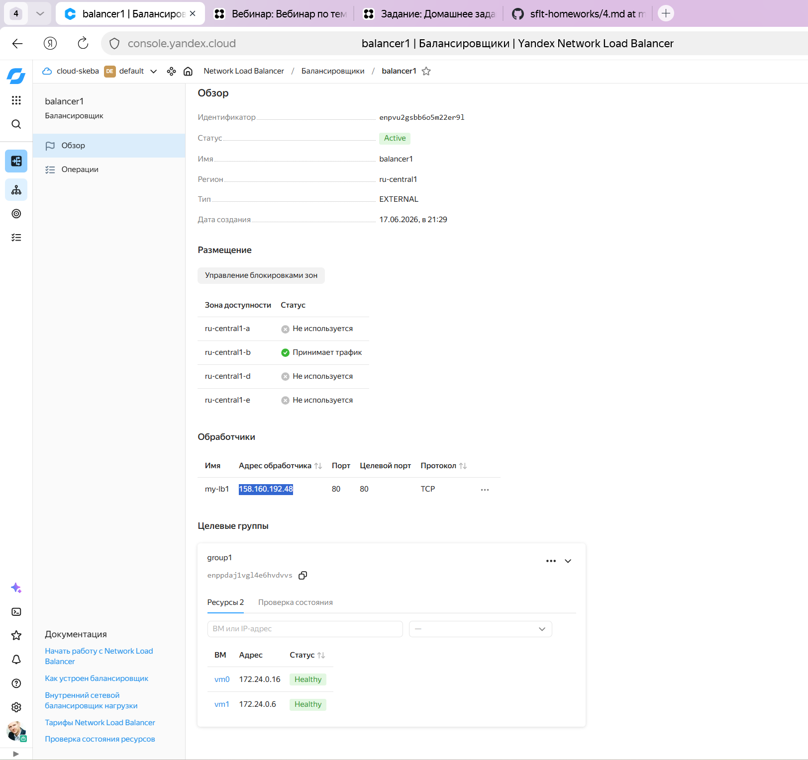
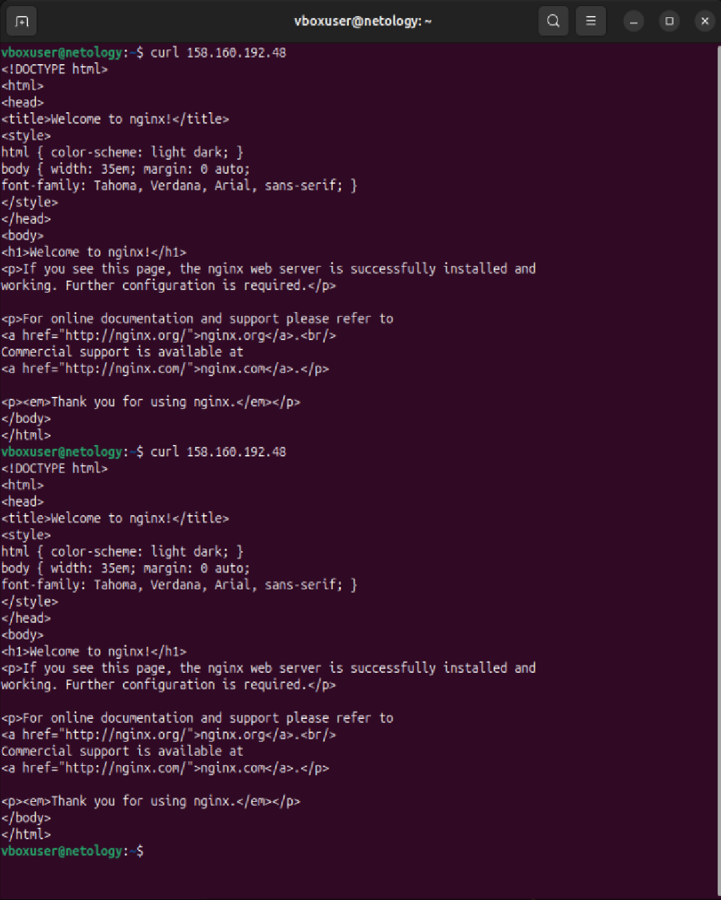

# Домашнее задание к занятию "`Отказоустойчивость в облаке`" - `Скобелкин А.В.`

---

### Задание 1

Возьмите за основу решение к заданию 1 из занятия «Подъём инфраструктуры в Яндекс Облаке»
1. Теперь вместо одной виртуальной машины сделайте terraform playbook, который:
   * *создаст 2 идентичные виртуальные машины. Используйте аргумент count для создания таких ресурсов;*
   * *создаст таргет-группу. Поместите в неё созданные на шаге 1 виртуальные машины;*
   * *создаст сетевой балансировщик нагрузки, который слушает на порту 80, отправляет трафик на порт 80 виртуальных машин и http healthcheck на порт 80 виртуальных машин.*

Рекомендуем изучить документацию сетевого балансировщика нагрузки для того, чтобы было понятно, что вы сделали.
2. `Установите на созданные виртуальные машины пакет Nginx любым удобным способом и запустите Nginx веб-сервер на порту 80.`
3. `Перейдите в веб-консоль Yandex Cloud и убедитесь, что:`
   
  * *созданный балансировщик находится в статусе Active,*
  * *обе виртуальные машины в целевой группе находятся в состоянии healthy.*
5. Сделайте запрос на 80 порт на внешний IP-адрес балансировщика и убедитесь, что вы получаете ответ в виде дефолтной страницы Nginx.

В качестве результата пришлите:
*1. Terraform Playbook.*
*2. Скриншот статуса балансировщика и целевой группы.*
*3. Скриншот страницы, которая открылась при запросе IP-адреса балансировщика.*

```
terraform {
    required_providers {
        yandex = {
            source  = "yandex-cloud/yandex"
            version = "0.209.0"
        }
    }
    required_version = ">=1.8.4"
}

provider "yandex" {
    cloud_id                 = "b1g9fi7ubfusdfsbbq0a"
    folder_id               = "b1g3u6tpspnd7qvsmqhf"
    service_account_key_file = "/home/vboxuser/.authorized_key.json"
    zone                    = "ru-central1-b"
}

resource "yandex_vpc_network" "network1" {
    name = "network1"
}

resource "yandex_vpc_subnet" "subnet1" {
    name           = "subnet1"
    zone           = "ru-central1-b"
    network_id     = yandex_vpc_network.network1.id
    v4_cidr_blocks = ["172.24.0.0/24"]
}

resource "yandex_compute_instance" "vm" {
    count = 2

    name        = "vm${count.index}"
    platform_id = "standard-v1"

    depends_on = [yandex_vpc_network.network1, yandex_vpc_subnet.subnet1]

    boot_disk {
        initialize_params {
            image_id = "fd8tm4ja1he7v7vknauu"
            size     = 10
        }
    }

    network_interface {
        subnet_id = yandex_vpc_subnet.subnet1.id
        nat       = true
    }

    resources {
        cores  = 2
        memory = 2
    }

    metadata = {
        ssh-keys = "ubuntu:${file("~/.ssh/new_terraform_key.pub")}"
    }
}

resource "yandex_lb_target_group" "group1" {
    name = "group1"

    depends_on = [yandex_compute_instance.vm]

    dynamic "target" {
        for_each = yandex_compute_instance.vm
        content {
            subnet_id = yandex_vpc_subnet.subnet1.id
            address   = try(target.value.network_interface[0].ip_address, "N/A")
        }
    }
}

resource "yandex_lb_network_load_balancer" "balancer1" {
    name = "balancer1"
    deletion_protection = false

    depends_on = [yandex_lb_target_group.group1]

    listener {
        name = "my-lb1"
        port = 80
        external_address_spec {
            ip_version = "ipv4"
        }
    }

    attached_target_group {
        target_group_id = try(yandex_lb_target_group.group1.id, "N/A")

        healthcheck {
            name = "http"
            http_options {
                port = 80
                path = "/"
            }
        }
    }
}
```

`



[Main.tf](config/main.tf)`


---


---
